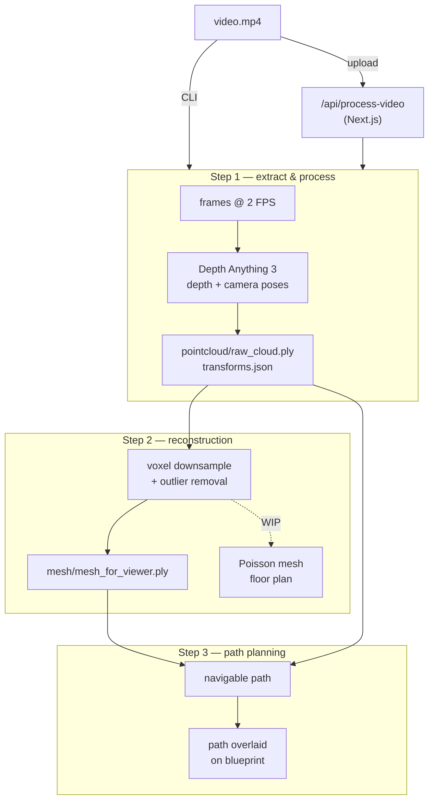

# Construct

Generate an indoor 3D model from a video walkthrough.

Point a phone camera around a room, upload the clip, and the pipeline recovers
per-frame depth + camera poses ([Depth Anything 3](https://github.com/ByteDance-Seed/depth-anything-3)),
fuses them into a point cloud, and reconstructs the space.

## Pipeline



| Step | Script | In → Out |
|------|--------|----------|
| 1 | `src/step1_extract_and_process.py` | video → frames @2 FPS → DA3 depth + poses → `transforms.json`, `depth/`, `images/`, `pointcloud/raw_cloud.ply` |
| 2 | `src/step2_reconstruction.py` | raw cloud → voxel downsample + outlier removal → `mesh/mesh_for_viewer.ply` |
| 3 | `src/step3_path_planning.py` | cloud + poses → navigable path, overlaid on the blueprint |
| — | `src/blueprint.py` | standalone: fuse scan → Poisson mesh → 2D blueprint render |

Step 2's Poisson mesh, duplicate-structure removal, and floor-plan slice are
written but currently commented out in `main()`.

GPU is used where it helps: PyTorch/CUDA for DA3, CuPy for the distance math in
DBSCAN. Everything falls back to CPU if CUDA is missing.

## Setup

```bash
python -m venv .venv
.venv\Scripts\activate
pip install -r requirements
```

`requirements` pins CUDA 13.0 torch wheels — install a matching torch build if
your driver differs. DA3 is installed from git as an editable dep (`depth-anything-3/`).

`.env`:

```
HF_TOKEN=<your huggingface token>   # to pull depth-anything/DA3NESTED-GIANT-LARGE
```

## Run

CLI:

```bash
python src/step1_extract_and_process.py <video.mp4> data/scan_001
CONSTRUCT_OUTPUT_DIR=data/scan_001 python src/step2_reconstruction.py
python src/step3_path_planning.py [save_dir]
```

Both scripts fall back to hardcoded `DEFAULT_*` paths at the top of the file
when no args are passed — edit those, or pass args.

Web UI (Next.js):

```bash
cd frontend
npm install
npm run dev
```

Upload at `/upload`. `POST /api/process-video` saves the clip to `data/uploads/`,
creates `data/scan_<timestamp>/`, then spawns steps 1 and 2 with `.venv/Scripts/python.exe`.
It responds only when the whole pipeline finishes — expect a long request on
real videos.

## Layout

```
src/         pipeline steps
frontend/    Next.js app + upload API route
data/        scans, uploads (gitignored)
assets/      input videos
```
